# Hi there, I'm Aman Kumar 👋

**Software Engineer** specializing in **Backend & Distributed Systems**. Currently designing and operating enterprise-scale integration architecture for high-scale corporate systems while engineering high-performance financial infrastructure on the side.

Over my career, I've focused heavily on the critical intersections of **Fintech correctness**, **transactional consistency**, and **middleware orchestration**. I design with an obsession over observability, building event-driven systems that are simple to operate, resilient to cascading failures, and architected to scale under load.

I break down complex distributed systems design, transaction atomicity patterns, and modern backend mechanics on my technical portfolio at **[amankr.me](https://amankr.me)**.

---
<!-- TOP_REPOS_START -->
### 🚀 Most Active Repos (Last Year)

- [kizo](https://github.com/JDevAman/kizo) — 44 commits, +77,930 / -50,800
- [JDevAman](https://github.com/JDevAman/JDevAman) — 6 commits, +349 / -154
- [pagaar](https://github.com/JDevAman/pagaar) — 5 commits, +1,436 / -86
- [Projects](https://github.com/JDevAman/Projects) — 1 commits, +1 / -0
- [malenia](https://github.com/JDevAman/malenia) — 1 commits, +230 / -0

<!-- TOP_REPOS_END -->
---

### 📊 Engineering Metrics

---

### 🛠 Tech Stack & Ecosystem

**Languages & Frameworks:** Java • Spring Boot • Groovy • Node.js • TypeScript • Express

**Data Store & Middleware:** PostgreSQL (Prisma & Raw SQL tuning) • Redis • RabbitMQ • BullMQ

**Enterprise Integration & Web Server:** SAP Integration Suite • SAP BTP • OData • REST • SOAP • Nginx

**Cloud & Observability Infrastructure:** Docker • Linux Shell Architecture • GitHub Actions • GCP • Prometheus • Grafana • Pino (Structured Logging)

---

### 🧠 Architectural Philosophy

I build to understand how distributed layers move. The framework choice is secondary. The high-value questions I engineer against are always:
* **Why did it fail?** (Cascading failure blast radius, edge conditions)
* **Why did it scale?** (Bottleneck profiling, contention optimization)
* **Why did it become difficult to operate?** (Telemetry design, visibility gaps)
* **How can we make it simpler?** (Pruning architectural complexity)

---

### 🧩 Engineering Problem Solving
* **LeetCode:** 1,000+ Algorithmic Challenges Mastered *(Peak Rating: 1650+)*
* **CodeChef:** Ranked 524th in Starters Competition

---

### 🔗 Connect

[Portfolio Platform](https://amankr.me) • [LinkedIn Executive Network](https://linkedin.com/in/jdevAman) • [Secure Email](mailto:amankr.24b@gmail.com)